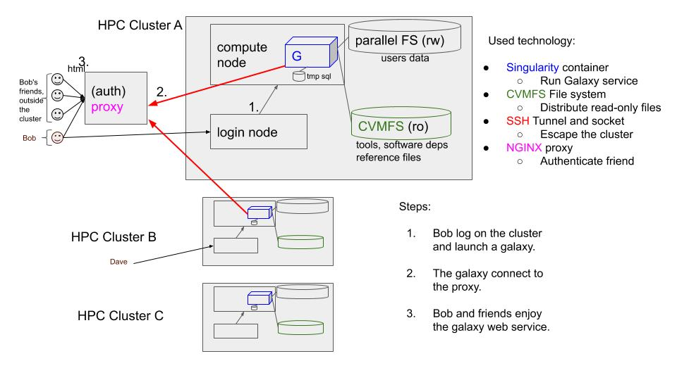

# singproxy: Singularity and Proxy tools

This utilities give the possibility to run web application on a high performance computing cluster
in a simple and secure way.


## Quick start

You can create a new datahub, galaxy and filebrowser application with

```
alias genapproxy=/cvmfs/soft.galaxy/v2/singproxy/genapproxy
app_path=~/projects/proj01/mysuperproject  ### Choose real user path here ###
genapproxy create --app=datahub --path=$app_path 
genapproxy create --app=galaxy --path=$app_path 
genapproxy create --app=filebroser --path=$app_path 
```


## How it's works


